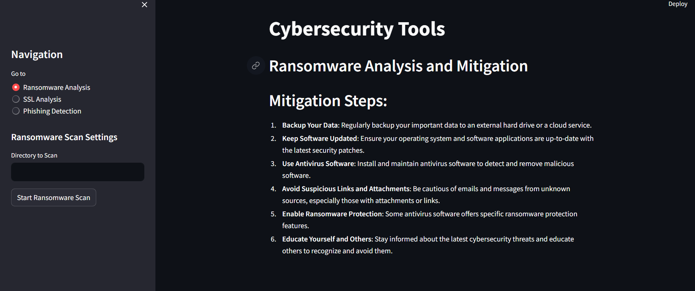
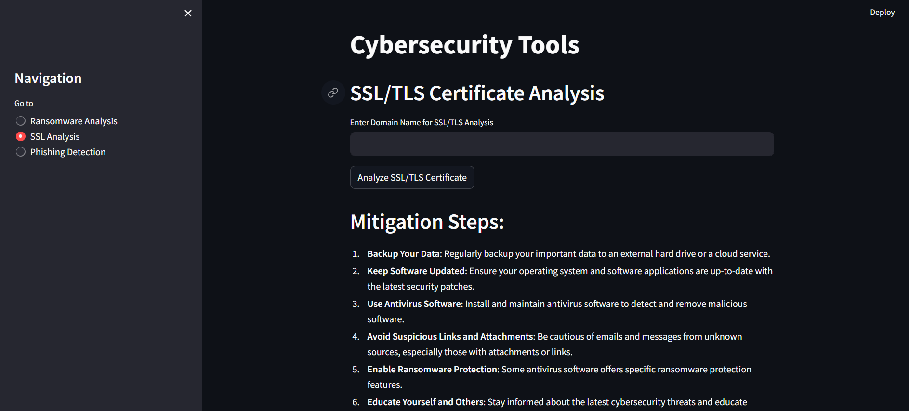
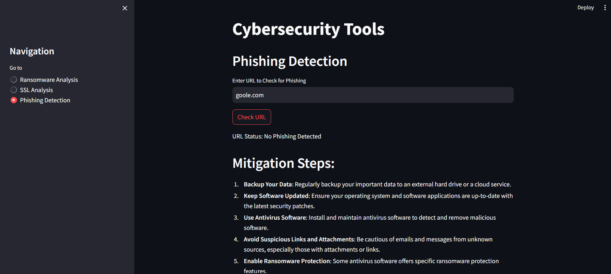

# Cybersecurity Analysis and Mitigation Tool

## Description

This project is a comprehensive tool for cybersecurity analysis and mitigation, developed using Python and Streamlit. It includes features such as ransomware analysis, phishing detection, SSL/TLS certificate analysis.

## Features

- **Ransomware Analysis:** Detects known ransomware files using SHA-256 hashes in a specified directory.
- **Phishing Detection:** Checks URLs against phishing databases using various APIs.
- **SSL/TLS Certificate Analysis:** Analyzes SSL/TLS certificates for expiration and validity.


## Requirements

Before running the project, ensure you have:

- Python 3.11 or higher
- Streamlit: `pip install streamlit`
- Requests: `pip install requests`
-pip install -r requirements.txt
-Create .env file and put VirusTotal API Key


### API Keys


- **VirusTotal API Key:** Obtain from [VirusTotal](https://www.virustotal.com/gui/) for ransomware detection.


## Installation

1. Clone the repository:

   ```bash
   git clone https://github.com/awanishyadav967/CyberSecurity-Analysis-and-Mitigation.git
   
2. Install Requirement mentioned above


# ScreenShot





## Author

- **Author:** [Avanish Yadav]
- **Email:** [avanishyadavvns23@gmail.com]

## Open to Contribute

Contributions are welcome! If you'd like to contribute to this project, feel free to fork the repository and submit a pull request with your changes.

Please adhere to the following guidelines:

- Follow Python coding standards.
- Write clear commit messages.
- Test thoroughly before submitting changes.

## Additional Information

For more details about the project or specific features, feel free to contact the author or refer to the project's.


   

